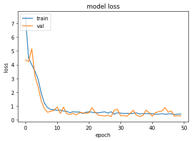

# BK224_404teamnotfound
Official repository for SIH Problem Statement
--> This Repository contains the solution for <b>Process Modelling and simulation</b> statement given by GAIL
  
<b>Technologies/Languages Used</b> -
<ul>
	<li>HTML</li>
	<li>CSS</li>
	<li>Javascript</li>
	<li>Bootstrap</li>
	<li>Flask</li>
	<li>Python</li>
</ul>	
--> Code for the frontend of the Application can be found out here - <a href="https://github.com/Aditya20kul/BK224_404teamnotfound/tree/master/Frontend">Code</a>
  
--> Code for the Backend of the Application can be found out here - <a href="https://github.com/Aditya20kul/BK224_404teamnotfound/tree/master/Backend-API">Code</a>	
  
--> To check out the working of the Application - <a href="https://sih-webapp.herokuapp.com/userset">Demo</a>
  --> API endpoint for Heat Exchanger - <a href="https://sih-utils.herokuapp.com/util">API</a>

# Machine Learning Model 
## Artificial Neural Network Architecture 
<table>
	<th>Layer (type)</th>
	<th>Output Shape</th>              
	<th>Param</th>   
	<tr>
	<td>dense_70 (Dense)</td>	<td> (None, 512)</td>               <td>3584 </td>     
	</tr>
	<tr>
	<td>dense_71 (Dense)</td>             <td>(None, 256)</td>               <td>131328</td>  
	</tr>	
	<tr>
	<td>dense_72 (Dense)</td>             <td>(None, 128)</td>               <td>32896</td> 
	</tr>	
	<tr>
	<td>dense_73 (Dense)</td>             <td>(None, 64)</td>                <td>8256 </td>     
	</tr>
	<tr>
	<td>dense_74 (Dense)</td>             <td>(None, 64)</td>               <td> 4160</td>      
	</tr>
	<tr>
	<td>dense_75 (Dense)</td>             <td>(None, 32)</td>                <td>2080</td>      
	</tr>
	<tr>
	<td>dense_76 (Dense)</td>             <td>(None, 1)</td>                 <td>33</td>  
	</tr>
</table>
## Epoch vs Loss Graph 

